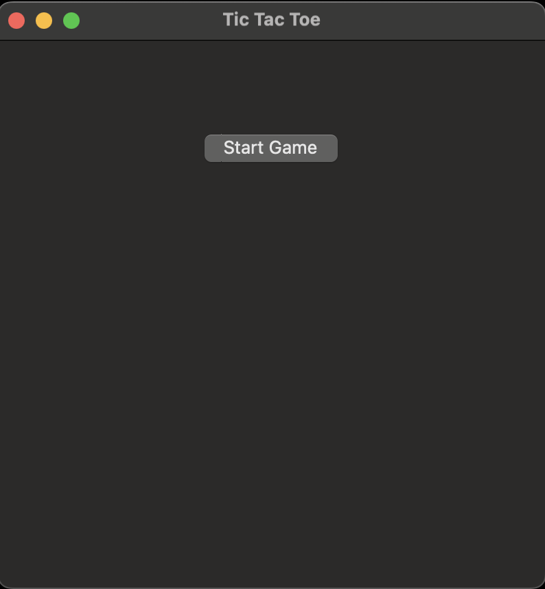
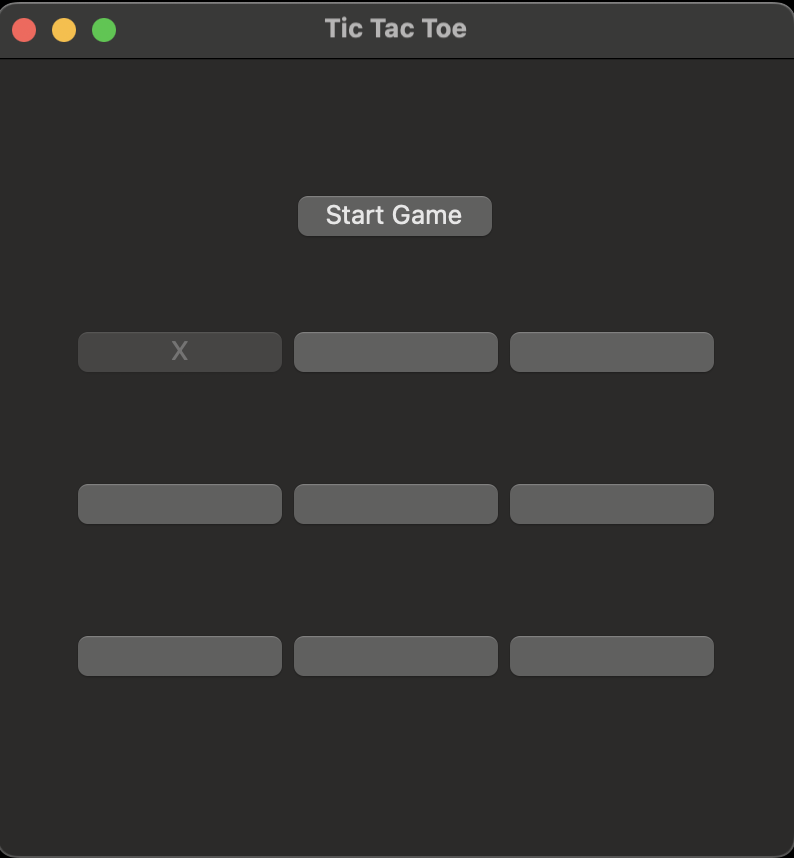
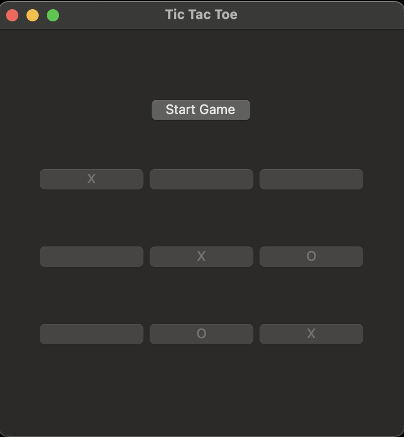

## Tic Tac Toe Game (Python Tkinter)

*PS. This is a game that I did for fun and learn Tkinter in Python.*

This is a simple Tic Tac Toe game implemented in Python using the Tkinter GUI library. The game features:

* A start screen to welcome players before the game begins.

* A 3x3 grid of buttons representing the game board.

* Two players (Player 1 and Player 2) who alternate turns.

* Visual updates on the buttons to show player moves ("X" and "O").

* Real-time status updates displaying the current player's turn.

* Automatic detection of game outcomes: win, draw, or ongoing.

* Disabling buttons after a move to prevent overwriting.

* A recursive function approach to handle the game flow and button click events.

* This project is ideal for beginners learning Python GUI programming, event-driven programming, and basic game logic implementation.

### Example

#### *More compact on Window*

**This is a start menu.**

### Thanks for reading.

